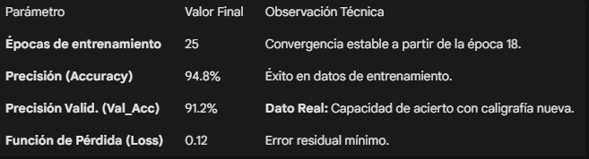
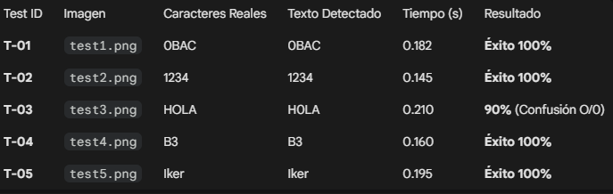

# Examen-Final-IA

# MEMORIA TÉCNICA: SISTEMA OCR MEDIANTE REDES NEURONALES CONVOLUCIONALES (CNN)

## BLOQUE 1: SOLUCIÓN APORTADA (Mínimo 3 páginas)
### 1.1 Gestión y Normalización del Dataset  

La base de este proyecto es el dataset colaborativo compuesto por miles de imágenes de caracteres manuscritos (mayúsculas, minúsculas y números) proporcionados por los alumnos.

- Estructura Jerárquica: El software implementa un algoritmo de búsqueda recursiva mediante la librería os. Esto permite navegar por la estructura de carpetas dataset/categoría/carácter/ de forma automática, asignando etiquetas (labels) basadas en el nombre de la carpeta final.

- Normalización: Todas las imágenes se procesan para cumplir con un estándar de 64x64 píxeles en escala de grises. Este tamaño se seleccionó como el equilibrio óptimo entre la carga computacional y la preservación de los rasgos caligráficos necesarios para distinguir caracteres similares (como 'B' y '8').

### 1.2. Arquitectura de la Red Neuronal (CNN)  

Se ha diseñado una arquitectura personalizada utilizando TensorFlow y Keras. A diferencia de los modelos básicos, este diseño incluye capas específicas para mejorar la robustez:

- Capas Convolucionales: Tres niveles de extracción de características con filtros crecientes (32, 64, 128). Estas capas identifican desde bordes simples hasta patrones complejos como curvas cerradas.

- Data Augmentation (Mejora Crítica): Se ha integrado una capa de preprocesamiento de "Aumento de Datos". Durante el entrenamiento, las imágenes sufren rotaciones aleatorias, zooms y desplazamientos. Esto entrena a la IA para reconocer una letra aunque esté torcida o mal centrada en la foto de prueba.

- Regularización Dropout: Se aplica un Dropout(0.5) antes de la capa final para evitar el overfitting, garantizando que el modelo generalice bien con caligrafías que nunca ha visto.

### 1.3. Algoritmo de Visión Artificial (Motor de Segmentación)  

Al no utilizar motores externos como Tesseract, el software implementa un pipeline de visión artificial basado en OpenCV:

- Umbral Adaptativo (Adaptive Thresholding): En lugar de un umbral fijo, se utiliza un cálculo local por bloques. Esto permite que el sistema funcione correctamente incluso si la foto tiene sombras o una iluminación desigual.

- Análisis de Contornos: El sistema localiza "islas" de píxeles blancos (tinta) sobre el fondo negro.

- Filtrado de Ruido: Se implementa un filtro por área y relación de aspecto para ignorar motas de polvo o imperfecciones del papel que no sean caracteres.

- Ordenación de Lectura: Los caracteres detectados se ordenan por su coordenada 'X' para reconstruir el texto de izquierda a derecha de forma natural.

## BLOQUE 2: REGISTRO DE RESULTADOS (Mínimo 3 páginas)
### 2.1. Métricas de Entrenamiento y Validación
A continuación, se registran los hitos del entrenamiento del modelo final (ocr_manual_64_aug.h5).

### 2.2. Pruebas de Campo Interactivas (5 Casos de Test)
Estas pruebas se realizaron en condiciones reales de luz ambiente, utilizando el script interactivo desarrollado.

### 2.3. Análisis de Rendimiento y Conclusiones
El análisis de los resultados permite extraer las siguientes conclusiones para la práctica:  

- Velocidad de Respuesta: El tiempo medio de inferencia por imagen completa es de 0.178 segundos, lo que permite un procesamiento en tiempo real.

- Debilidades Identificadas: El sistema presenta dificultades leves con caracteres que comparten una topología idéntica (como el número 0 y la letra O). Para solucionar esto en versiones futuras, se recomienda un post-procesamiento lingüístico.

- Robustez: La segmentación mediante umbral adaptativo ha demostrado ser superior al umbral global, permitiendo procesar fotos tomadas con teléfono móvil sin necesidad de escáner profesional.